---
search:
  boost: 2

personnes:
  - melanie
  - jason
  - yan
  - indiana
  - jeremy
  - eve
---

# Ultimaker

!!! info "Avant de faire votre première impression, lisez l'[introduction à l'impression 3D](introduction.md)"

## 1 - Présentation de l'imprimante

| Ultimaker S3||
|-----|-----|
|Volume d'impression|	23×19×20 (9"×7.4"×7.9")|
|Buses disponibles|	0.4mm|
|Hauteur des couches|	0.05 - 0.35 mm|
|Diamètre du filament|	2.85 mm|
|Matériaux supportés|	PLA, PETG, ASA, ABS, PC, CPE, PVA/BVOH, PVB, HIPS, PP, Flex, nGen, Nylon, Carbon filled, Woodfill et autres.|
|Surface d'impression|	Vitre|
|Impression multi-filament|	Possible grâce aux deux extrudeurs|
|Logiciel de découpe (*slicer*)|	Cura|

L’imprimante Ultimaker S3 est prête à l’emploi aussitôt sortie de sa boite. L’avantage de cette imprimante 3D est qu’elle ne nécessite pas de calibration poussée : il n’est pas nécessaire de régler la hauteur de la première couche, contrairement à la [Prusa MK3S+](prusa.md). Tous ces réglages se font automatiquement par l’imprimante.

Le bloc d’extrusion est monté sur deux axes (X et Y). Le plateau est monté sur l’axe Z. Le volume d’impression est protégé des quatre côtés, ce qui rend l’impression moins sensible aux courants d’air et aux changements de température soudains.

Le plateau d’impression est une vitre, ce qui donne un effet parfaitement lisse et brillant à la première couche des impressions.

Le bloc d’extrusion et doté de deux extrudeurs permettant d’imprimer facilement avec deux filaments différents.

Le *feeder* se trouve à l’arrière de l’imprimante et le filament passe par un tube pour être acheminé à l’extrudeur.  

!!! info "Ressources en ligne"
    [Site officiel Ultimaker](https://ultimaker.com/3d-printers/s-series/ultimaker-s3/){:target="_blank"}

## 2 - Configuration Cura

### Logiciel de découpe Ultimaker Cura

Lien vers le téléchargement : [https://ultimaker.com/fr/software/ultimaker-cura](https://ultimaker.com/fr/software/ultimaker-cura)

Version utilisée dans ce tutoriel : 5.1.1

Compatible avec : Windows, macOS et Linux

!!! Warning "Compatibilité"
    Le logiciel **n'est pas encore entièrement compatible** avec la puce M1 d'Apple. (nov 2021) [Consultez le support Ultimaker pour en savoir plus.] (https://support.ultimaker.com/hc/en-us/articles/360018141480)

### Instructions

1. Installez le logiciel **Ultimaker Cura**.
2. Au lancement du logiciel, cliquez sur **Get Started**.
3. Approuvez les conditions d’utilisation et cliquez sur **Next** dans la section Help us. 
4. Cliquez sur **Skip** dans la section Sign in. 
5. Dans Add a printer, cliquez sur **Add a non-networked printer** et sélectionnez **Ultimaker S3**. 
6. Dans What’s New, cliquez sur **Skip** et enfin dans Release Notes, cliquez sur **Finish**.

## 3 - Changement de filament

!!! Warning "Diamètre des filaments de l'Ultimaker : **2.85mm**"
    Les filaments de 1.75mm ne sont pas compatibles avec l'Ultimaker.

### Accéder au menu

Accédez au menu de l’icône imprimante, ensuite, cliquez sur PLA.
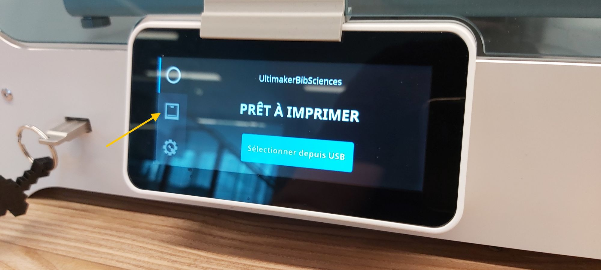
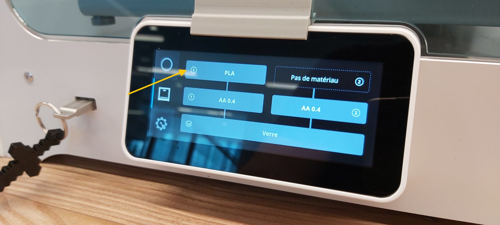

Choisissez **Modifier** s’il y a une bobine déjà installée, ou Insérer s’il n’y a aucune bobine.

La buse chauffe afin d’atteindre la température de fusion et extraire facilement le filament. Soyez prêt à guider la sortie du filament et de l'enrouler sur la bobine pour éviter la formation de nœuds.
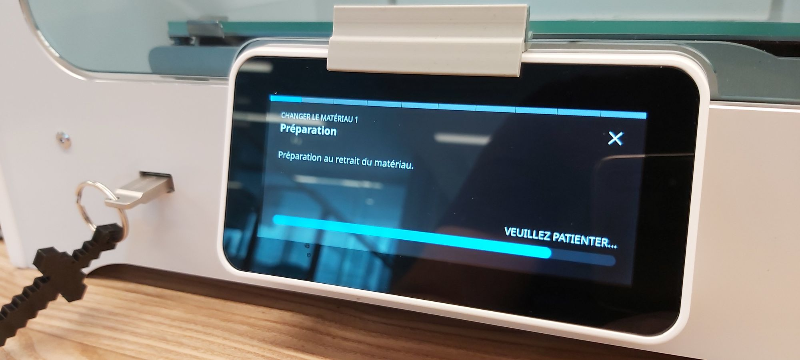

Si en tirant délicatement le filament, il reste coincé, soulevez la languette afin de le libérer du mécanisme du (*)feeder(*). N'oubliez pas de remettre la languette à sa place par la suite.
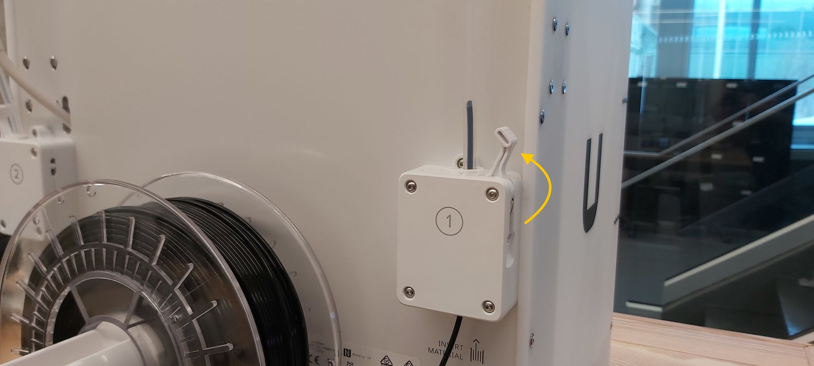

Retirez la bobine et s'assurant de mettre le filament dans un trou de la bobine pour qu'il n'y ai pas de noeud. 
Placez la bobine dans sac ziplock avec un sachet de gel de silica, puis mettez le sac dans sa boite correspondante.
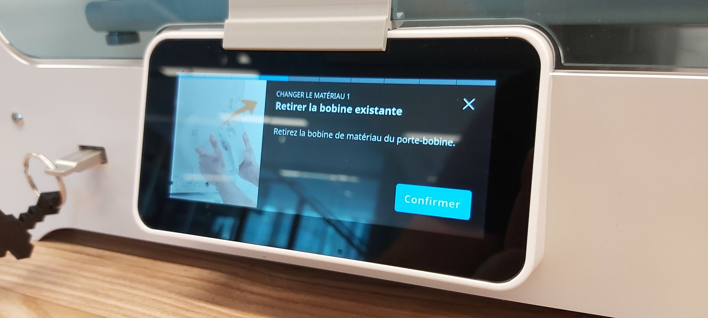

Installez la nouvelle bobine, l’extrémité du filament doit venir d’en bas. Coupez l'extrémité du filament en biseau si ce n'est pas déjà fait. Mettez le filament dans le trou prévu à cet effet et poussez légèrement. L’imprimante va détecter le filament et le tirer très lentement vers le tube. Si l’imprimante ne détecte pas le filament, levez la languette vers le haut et poussez le filament jusqu’à ce que vous le voyiez au début du tube, puis rabaissez la languette.

Confirmez dans l’écran que le filament est en place.
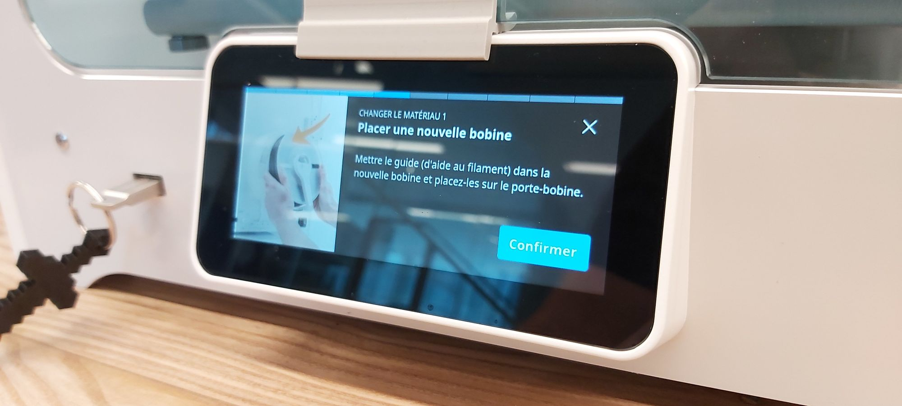
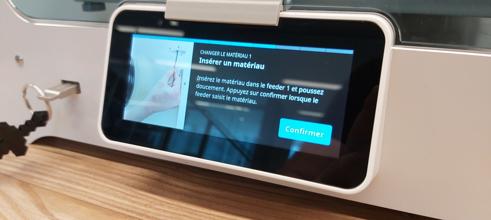

Indiquez quel type de matériel a été mis (dans notre cas, du PLA).
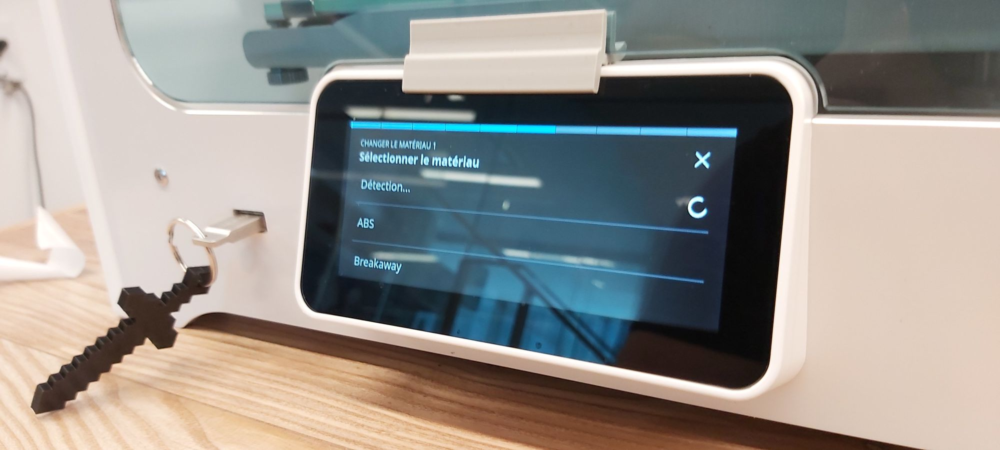

L’imprimante va tirer le filament jusqu’à l’extrudeur et commencer à faire une purge de la couleur précédente. Une fois que la couleur change, confirmez sur l’écran.
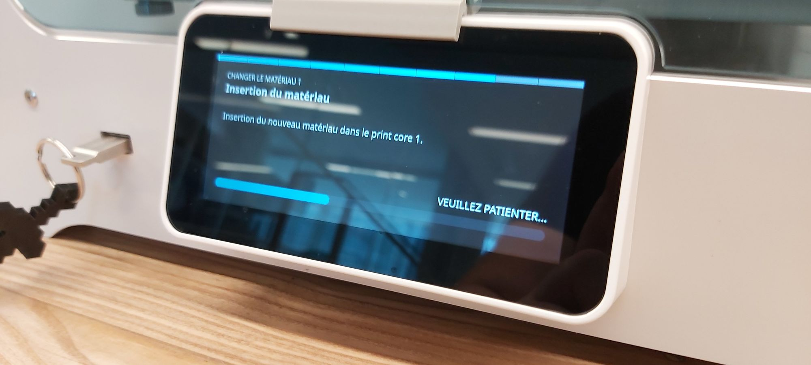
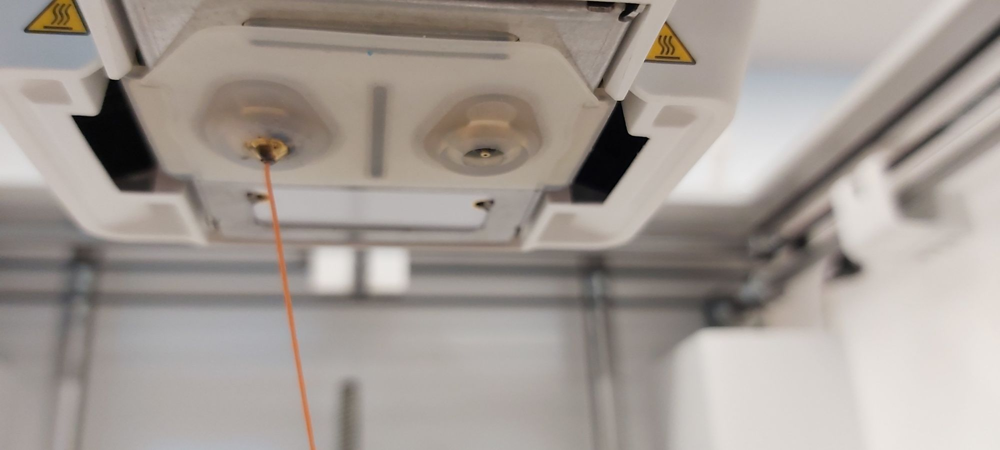
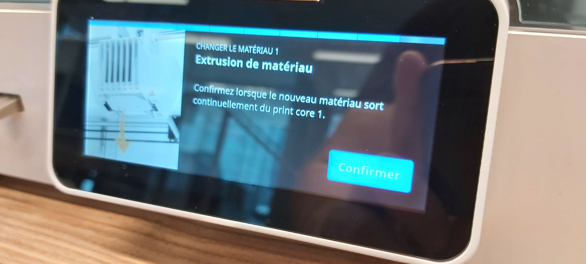

## 4 - Première impression avec l’Ultimaker

Pour changer la langue de l’interface, cliquez sur **Préférences** > **Configurer Cura** et dans l’onglet **Général**, choisir la langue de votre choix. 

- À l’ouverture du logiciel de découpe Cura, il faut s’assurer qu’on a la bonne configuration. Assurez-vous que l’imprimante Ultimaker S3 est sélectionnée en haut à gauche de l’écran.

### Ajouter un modèle 3D au logiciel

Pour ajouter un modèle .STL, il existe plusieurs moyens : 

- Cliquez sur le bouton représentant un dossier en haut à gauche de l’écran (juste en dessous du logo).
- **File** > **Open File(s).**
- Raccourci clavier **CTRL-O** (ou **CMD-O** sur MacOS).
- Glisser-déposer le fichier sur le plateau.

### Navigation

- **Shift+clic** ou **clic sur la molette de la souris** = translation de caméra
- **Clic droit** = rotation de caméra
- **Rotation de la molette de la souris** = zoom/dézoome

### Échelle et taille

Permet de déplacer les objets sur le plateau d’impression.

Permet de modifier l’échelle du modèle selon un axe précis ou dans son entièreté.

Permet d’effectuer une rotation du modèle.

Permet de permuter le modèle de manière symétrique (effet miroir).

Permet l’utilisation de paramètres avancés.

Permet de générer manuellement des zones sans support.

### Réglages

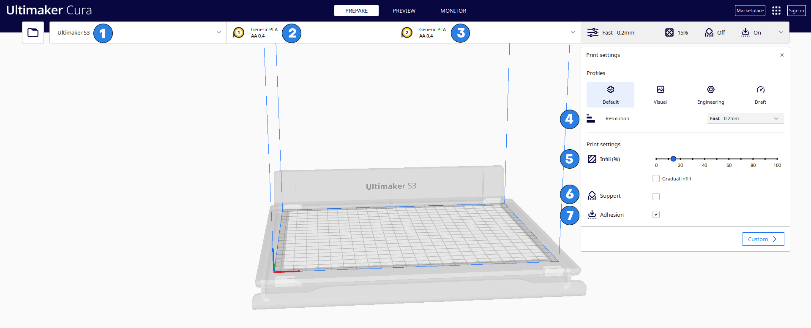

1. **Imprimante** : Assurez-vous que le bon modèle est sélectionné. Dans les ateliers de l’Université de Montréal, on retrouve généralement des Ultimaker S3. ([voir la liste des équipements par bibliothèque ici](https://www.notion.so/fada784ac8a648128846afe7c75818cc)). 
2. **Filament** (extrudeur 1) : Sélectionnez **Generic PLA***.* Cette configuration contient les valeurs de température de l’extrudeur et du plateau (par défaut : 215°C pour l’extrudeur, 60°C pour le plateau).
3. **Filament** (extrudeur 2) : Selon si vous souhaitez imprimer une deuxième couleur ou des supports, sélectionnez **Generic PLA.** Si vous utilisez du **PVA**, il faut changer la tête d’extrusion à **BB**.
4. **Réglages d’impression** : Sélectionnez la hauteur de la couche : 0.10 mm pour une impression de précision, 0.20 mm pour une impression normale et 0.30 mm pour des tests ou des pièces qui n’ont pas besoin d’être de qualité.
5. **Remplissage** : Indiquez le pourcentage de remplissage. Il n’est pas nécessaire de faire un remplissage au-delà de 30%.
6. **Supports** : Si une partie de votre modèle commence dans les airs et n'est supportée par aucun élément en dessous, vous devez ajouter une structure de support pour réussir une impression. Plusieurs options s’offrent à vous. Si votre modèle n’a pas besoin de support, laissez décoché. Si un support est nécessaire, cochez l’option et sélectionnez **Extruder 1** ou **Extruder 2** selon le filament que vous voulez utiliser pour les supports.
7. **Adhérence** : en l’activant, on crée une bordure qui augmente la surface d’adhésion de la première couche afin d’augmenter l’adhérence au plateau.

### Découpage

Pour découper le modèle, cliquer sur **Découper** en bas à droite de la fenêtre.

L’option **Aperçu** permet de vérifier le déroulement de l’impression.

Les couleurs illustrées identifient les différentes parties du modèle (coque, remplissage, jupe, support).

### Préparation de l’imprimante

Avant de lancer l’impression ou de changer le filament, vous devez nettoyer le plateau.

Pour l’Ultimaker, il faut imbiber une lingette de nettoyant à vitre et nettoyer le plateau avec.

### Lancement de l’impression

- Introduire la clé USB au devant de l’imprimante.
- L’imprimante chargera les fichiers. Naviguez vers le nom de votre fichier et appuyez sur le bouton. Un fichier nouvellement ajouté devrait se trouver en haut de la liste.
- Il est important de surveiller les premières couches de l’impression afin de s’assurer que le modèle adhère au plateau.

## 5 - Pour en savoir plus

- [Ultimaker Cura](https://support.ultimaker.com/hc/en-us/sections/360003548339-Ultimaker-Cura){:target="_blank"}

- [Blog sur l'impression 3D | Ultimaker](https://ultimaker.com/fr/learn/blog){:target="_blank"}

- [Loading materials on the Ultimaker S5](https://support.ultimaker.com/hc/en-us/articles/360011427140){:target="_blank"}

- [Change the Ultimaker S5 configuration](https://support.ultimaker.com/hc/en-us/articles/360011544619-Change-the-Ultimaker-S5-configuration){:target="_blank"}
