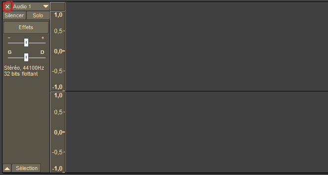

---
personnes:
  - guy
---

# Les bases du montage audio avec Audacity

Audacity est un logiciel libre de traitement audio. Il permet de réaliser des enregistrements, de les éditer, de les mixer, de les modifier, de les analyser, de les convertir et de les publier sur Internet. Il est disponible pour Windows, macOS et Linux.

## Installation

Téléchargez la dernière version d'Audacity sur le site officiel : [https://www.audacityteam.org/download/](https://www.audacityteam.org/download/)

## Importer

Commencez par importer votre fichier audio. Si vous avez enregistré votre extrait dans un de nos studios d’enregistrement, c’est le fichier nommé Stereo Mix que vous allez importer (en format .wav).

L’importation se fait dans le menu **Fichier** → **Importer** → **Audio**.

<video src="/assets/videos/audacity1.mp4"  controls></video>

## Zoom avant/arrière

Si vous souhaitez une vue d’ensemble ou au contraire, que vous voulez voir les détails d’une section, utilisez l’outil de Zoom avant et arrière (les loupes avec un + et un -).

<video src="/assets/videos/audacity2.mp4"  controls></video>

## Réduction du bruit

Audacity permet, en quelques clics, d’éliminer le bruit ambiant (par ex. ventilation).

1. Sélectionnez la partie vide afin de capturer l’ambiance de la pièce.
   
2. Allez à Effets > Réduction de bruit. Une fenêtre s’ouvrira. Changez les valeurs comme ci-dessous :
   
3. Avant d’appliquer la réduction de bruit, le logiciel a besoin d’analyser le bruit ambiant seulement, d’où l’intérêt de sélectionner seulement la zone sans voix. Cliquez sur Prendre le profil du bruit.
4. Maintenant que le logiciel a un profil du bruit, sélectionnez l’audio en entier avec le raccourci Ctrl-A et allez à Effets > Répéter Réduction de bruit ou Ctrl-R pour répéter le dernier effet.

Le bruit ambiant devrait disparaître. Si le bruit persiste, vous pouvez répéter l’opération mais attention, vous risquez de détériorer la qualité du son.

<video src="/assets/videos/audacity3.mp4"  controls></video>

## Organiser

1. Commencez par (ré)écouter votre enregistrement.
2. Vous pouvez, si vous le souhaitez, découper votre piste en différentes sections pour faciliter le repérage. Pour ce faire, utilisez l’outil de sélection, placez votre curseur à l’endroit sur la piste où vous voulez faire une séparation puis faites un clic droit et sélectionnez Split Clip. Vous pouvez ensuite donner un nom significatif aux sections en double cliquant sur leur titre.

3. À cette étape, commencez à réfléchir à quelles sections seront supprimées ou déplacées, ou si d’autres éléments seront insérés entre certaines parties.
4. Vous pouvez aussi vous créer une nouvelle piste temporaire où vous pourrez stocker les portions à déplacer. Pour ce faire, allez dans le menu **Pistes** → **Ajouter nouvelle** → **Piste stéréo**.

## Modifier les pistes

### Couper des parties 

- Pour supprimer une section, utilisez l’outil de sélection et sélectionnez la portion à couper. Faites ensuite un clic droit et sélectionnez Couper et raccorder. Cela aura pour effet de raccorder la portion qui précède et la portion qui suit la partie coupée.
  <video src="/assets/videos/audacity4.mp4"  controls></video>

- Si vous voulez couper une portion, mais que vous ne souhaitez pas la supprimer (par exemple, vous voulez la placer ailleurs), sélectionnez plutôt Split Clip lorsque vous faites votre clic droit sur la sélection. Si vous vous étiez créé une piste provisoire, vous pouvez y glisser votre portion nouvellement obtenue en attendant de lui trouver le bon emplacement dans la piste principale.
- Une fois que votre travail d’édition de votre piste principale est terminé, supprimez votre piste provisoire (si vous en aviez créé une), en cliquant sur le x en haut à gauche de la piste.

### Ajouter des fondus

Pour ajouter un fondu, sélectionnez la zone dont vous souhaitez progressivement baisser le niveau sonore. Avec l’outil de niveau, Placer des points sur la piste puis rapprochez-les de la forme d’onde du signal sonore de façon à réduire progressivement son amplitude.

<video src="/assets/videos/audacity5.mp4"  controls></video>

## Ajouter des pistes (musique, effets sonores)

Une fois que votre piste principale vous satisfait, vous pouvez ajouter des musiques d’ambiance et/ou des effets sonores.
Trouvez la liste des ressources ici.

Vous pouvez ajouter votre nouvelle piste en allant dans le menu **Fichier** > **Importer** > **Audio…**
Vous pouvez alors choisir le fichier audio que vous souhaitez ajouter à votre projet. Une nouvelle piste s’ajoutera alors à votre projet en-dessous de la première.

Vous pouvez alors modifier cette nouvelle piste de la même façon que vous avez modifié la première (couper des portions, faire des fondus, etc.)

<video src="/assets/videos/audacity5.mp4"  controls></video>

## Références

- [https://www.audacityteam.org/](https://www.audacityteam.org/)
- [https://www.audacityteam.org/help/](https://www.audacityteam.org/help/)
- [https://www.audacityteam.org/help/documentation/](https://www.audacityteam.org/help/documentation/)

