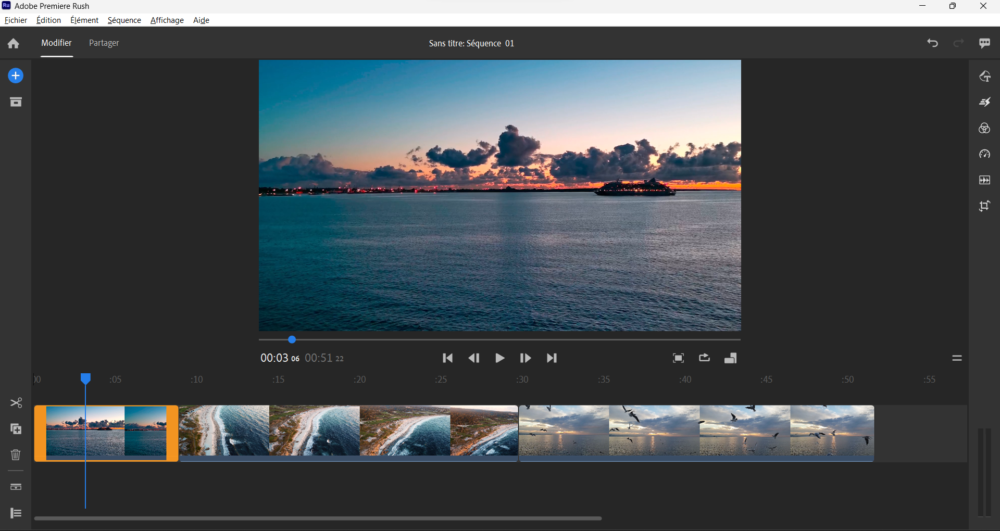
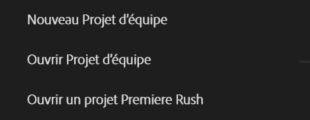
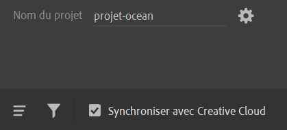
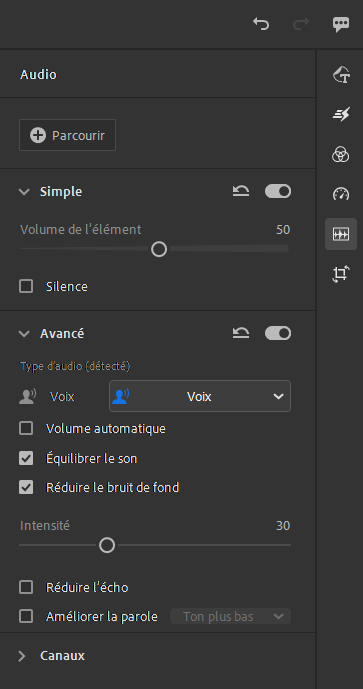

---
personnes:
  - guy
---

# Adobe Premiere Rush

## Création d’un projet de montage sur Adobe Premiere Rush

- Cliquer sur **Créer** un nouveau projet.
- L’explorateur de fichiers apparaît à la gauche de l’interface.
- Au bas de l’écran, **inscrire le titre de votre projet**.

## Importation des médias

- Sélectionner les médias désirés dans l’Explorateur de médias.
- Cliquer sur **Créer**.
- Les fichiers sélectionnés apparaissent dans le même ordre sur la Timeline.

!!! Tips
    Avec le pointeur, survoler les différentes fonctions de l’interface. Une info-bulle affiche le rôle des différentes fonctions.

## Faire un montage

- Déplacer le point bleu pour faire défiler la vidéo.
- Dans la Timeline, choisir le média à modifier.
- Placer la tête de lecture bleue à l’endroit où vous désirez faire une coupure.
- Cliquer sur l’icône **Ciseau** située à gauche de la Timeline.
- Sélectionner l’élément encadrée en jaune et cliquer sur l’Icône de la corbeille.

!!! Tips
    Il est possible de déplacer l’ordre des médias sur la Timeline. Il suffit de cliquer sur le média et de le faire glisser à l’emplacement désiré.

## Inverser une image (pour le tableau lumineux transparent)

À droite de l’interface, se trouve les outils d’amélioration pour peaufiner le montage vidéo.

- Sur la Timeline, cliquer sur le **média à inverser horizontalement**. Un encadré orange apparaît.
- À droite de l’interface, choisir l’option **Recadrage et rotation**.
- Cliquer sur **Miroir horizontal.**

## Incruster une image sur fond vert

Adobe Premiere Rush n’offre pas l’effet Incrustation sur fond de couleur. Pour ce faire, il est nécessaire de passer par Adobe Premiere Pro.

### Solution:

1. Faire le montage de base (votre vidéo avec fond vert) avec Adobe Premiere Rush. 
2. Ouvrir le logiciel Adobe Premiere Pro. 
3. À gauche au bas de l’interface, cliquer sur **Ouvrir un projet Premiere Rush**.
    
    
    
4. Sélectionner ****votre projet sur fond vert. 
5. L’interface de montage de Premiere Pro s’ouvre automatiquement. 
6. Référer à ce tutoriel simple et complet pour incruster votre image de fond avant de l’exporter en format .mp4 

<iframe width="560" height="315" src="https://www.youtube-nocookie.com/embed/0up1s8zOH5Q?si=smgfdcTaCtLARf3X" title="YouTube video player" frameborder="0" allow="accelerometer; autoplay; clipboard-write; encrypted-media; gyroscope; picture-in-picture; web-share" referrerpolicy="strict-origin-when-cross-origin" allowfullscreen></iframe>

## Exporter le projet en format vidéo

Sélectionner votre projet.

1. En haut de l’interface, cliquer sur **Partager.**
2. Nommer le fichier (exemple : projet_ocean).
3. Choisir la destination de l’exportation (**Enregistrer dans…**).
4. Cliquer sur **Exporter.**
5. Une fois l’exportation complétée, cliquer sur **Terminer.**

## Sauvegarde de projet

2 options : 

1. Adobe Premiere Rush conserve localement les projets. Ceux-ci s’affichent à l’ouverture de l’application.
2. Lors de sa création, le projet se synchronise dans votre compte Creative Cloud. Il devient accessible sur tablette, téléphone intelligent ou autre ordinateur afin de poursuivre un montage.
    
    
    

## Qualité du son

Une bonne compréhension du texte et de la voix importent beaucoup dans une vidéo explicative.

Certains environnements sont moins propices à une bonne prise de son. Pour éliminer un bruit indésirable ou maximiser l’enregistrement d’une voix, suivre ces étapes :

1. Sur la Timeline, cliquer sur la piste sonore. Un encadré jaune s’inscrit.
    
    
    
    1. Sélectionner ****l’icône de son à la droite de l’interface.
    2. Activer **Voix** et les diverses options se trouvant juste dessous. 
    3. À l’écoute, évaluer les options qui procurent une plus grande richesse de la voix.  
    
    
    
### Ressources en ligne

[Initiation à Premiere Rush](https://helpx.adobe.com/ca_fr/premiere-rush/tutorials.html)

[Adobe Rush Tutorial [UPDATED] - How to Edit Videos with Premiere Rush!](https://www.youtube.com/watch?v=YsGQ_Bwi6Zg&t=730s)